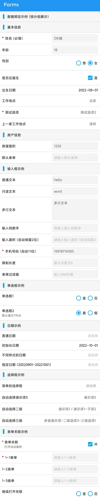
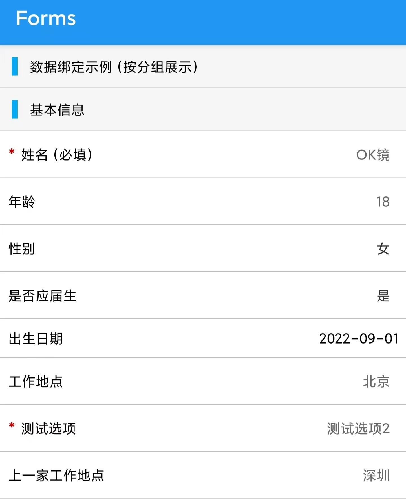
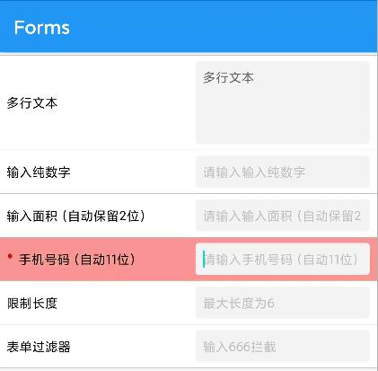
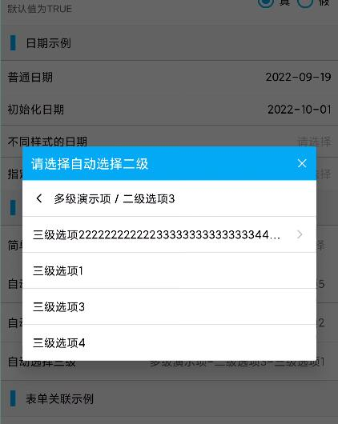
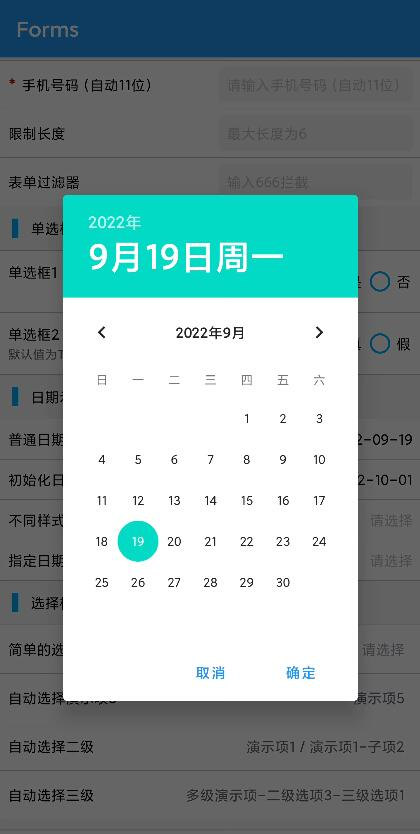

# Android 表单库

基于`RecyclerView `的Android 动态表单，当默认的表单项无法满足业务需求可自定义扩展。

**1、功能列表**

- 单选框

- 复选框

- 日期选择

- 文本框：单行文本、多行长文本、数字输入、浮点输入、手机号码、自定义输入类型等。

- 单项列表选择框：支持多级选择，自定义数据项数据源（如字典表）。

- 表单过滤器：支持自定义内容过滤，如：敏感字符过滤、非法日期选择过滤等等。

- 表单关联：一个表单项关联多个子表单的情况，一般为`是否xxx`然后关联要填写的表单内容。

- 表单校验：支持自定义验证器，高亮定位到错误位置。

- 数据绑定：支持表单直接关联到实体类，实时更新实体字段值。

- 扩展表单：基于`viewType`来定义表单类型，方便自行自定义表单和表单渲染。

**2、布局、图标、颜色自定义**

表单库均已`from_xxx`的规范命名。

颜色修改：修改颜色时在你的主程序的样式中覆盖`colors.xml`定义的颜色值即可。

图标修改：以相同的文件名直接放在你的主程序下即可。

布局修改：在本项目`layout`中复制一份你要修改的布局到你的主程序下做对应的修改即可。

## 开始使用


[](https://jitpack.io/#raedev/android-forms)

``` gradle
buildscript {
    repositories {
        maven { url 'https://jitpack.io' }
    }
}
dependencies {
    // $TAG取JitPack最新版本
    implementation 'com.github.raedev:forms:$TAG'
}
```

## 示例演示

**更多使用示例请查看[MainActivity](./app/src/main/java/com/raedev/forms/app/MainActivity.kt)**


> 所有表单项



> 纯展示只读状态



> 表单校验（高亮）



> 多级选项



> 日期选择



## 自定义表单

大概步骤如下，或者参考`EditTextFormItem` 来实现。

1. `EditTextFormItem2` 继承 `EditTextFormItem`
2. 重写以下方法

```kotlin
  override val layoutId: Int = R.layout.form_item_edit_text2
  // 类型自己定义，不要跟FormType重复即可
  override val formType: Int = 123123
  // 实现自己的方法
  override fun onBindViewHolder(holder: FormViewHolder){}
  override fun onBindViewEvent(holder: FormViewHolder){}
  override fun onUnBindViewEvent(holder: FormViewHolder){}
```

3、重写一个`FormRender`表单渲染器

```kotlin
class YourFormRender(
    context: Context,
    adapter: FormGroupAdapter,
    fragmentManager: FragmentManager
) : FormRender(context, adapter, fragmentManager) {

    /**
     * 添加文本编辑框
     */
    protected open fun addEditText2(
        inputType: FormInputType,
        label: String, name: String, value: String? = null, required: Boolean = false,
        parent: FormItem? = null,
    ): EditTextFormItem {
        return EditTextFormItem2(inputType, label, name, value, required).addToFormGroup(parent)
    }
}
```